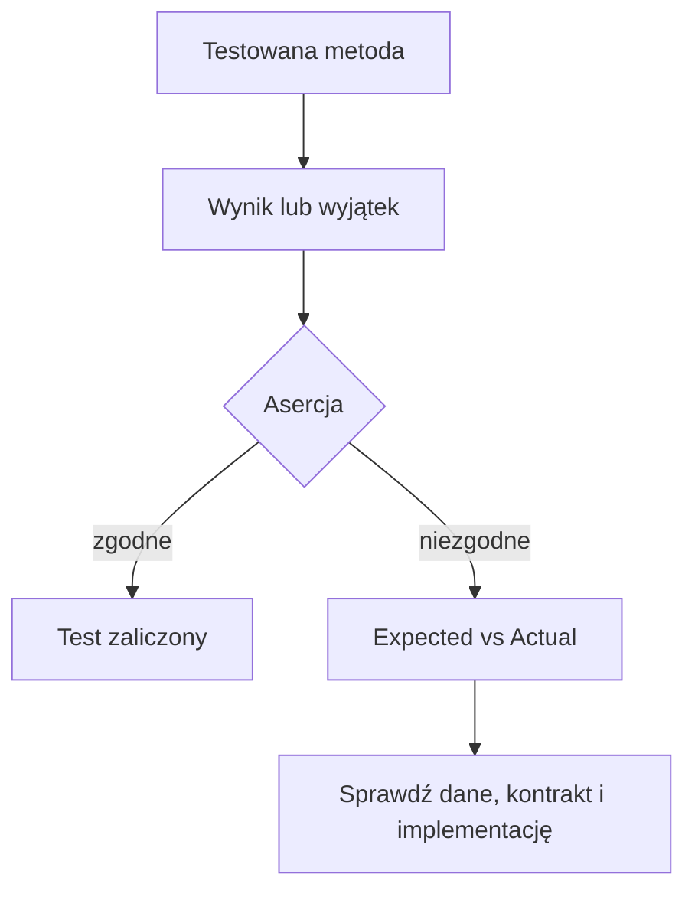

# 3. Asercje i interpretacja wyników

## Asercja jako zapis oczekiwania

Asercja nie jest ogólnym „sprawdź, czy program działa”. Jest konkretnym zdaniem o kontrakcie metody. Im bardziej precyzyjne oczekiwanie, tym łatwiej zrozumieć porażkę.

Najczęściej używane asercje w tym module:

```csharp
Assert.Equal(12.5m, cena);
Assert.True(czyDostepny);
Assert.Null(brakujacyWynik);
Assert.Throws<ArgumentException>(() => katalog.Dodaj("", 10m));
```



Źródło: [diagram-asercje.mmd](diagram-asercje.mmd).

## `Assert.Equal`

`Assert.Equal` porównuje oczekiwaną wartość z wynikiem. Dla liczb całkowitych i tekstów porównanie jest zwykle bezpośrednie. Dla `decimal` warto jawnie zapisać oczekiwaną precyzję wynikającą z kontraktu.

```csharp
[Fact]
public void ZnajdzCene_ExistingCode_ReturnsPrice()
{
    KatalogProduktow katalog = new();

    decimal? cena = katalog.ZnajdzCene("kawa");

    Assert.Equal(12.50m, cena);
}
```

Jeśli test oczekuje `12.50`, a kod zwróci `10.50`, komunikat pokaże `Expected: 12.50` oraz `Actual: 10.50`. Najpierw sprawdź, czy pomyliłeś dane testowe, czy implementacja łamie kontrakt.

## `Assert.True`

`Assert.True` jest dobry, gdy metoda zwraca warunek i nazwa testu dopowiada, jaki stan ma być prawdziwy.

```csharp
[Fact]
public void CzyZawiera_ExistingCode_ReturnsTrue()
{
    KatalogProduktow katalog = new();

    bool znaleziono = katalog.CzyZawiera("kawa");

    Assert.True(znaleziono);
}
```

Gdy ważne jest zarówno `true`, jak i `false`, użyj `[Theory]` z oczekiwanym wynikiem. Nie sprawdzaj tylko jednej strony warunku.

## `Assert.Null`

`Assert.Null` dokumentuje, że brak wyniku jest legalnym rezultatem, a nie wyjątkiem. To przydatne dla wyszukiwania opcjonalnego.

```csharp
[Fact]
public void ZnajdzCene_UnknownCode_ReturnsNull()
{
    KatalogProduktow katalog = new();

    decimal? cena = katalog.ZnajdzCene("nie-ma-takiego-kodu");

    Assert.Null(cena);
}
```

Typ zwracany `decimal?` jest częścią kontraktu. Nie należy zwracać przypadkowo `0`, jeżeli `0` oznacza prawidłową cenę.

## Wyjątki i przypadki brzegowe

`Assert.Throws<TException>` sprawdza, czy wywołanie zakończyło się oczekiwanym typem wyjątku:

```csharp
[Fact]
public void Dodaj_EmptyCode_ThrowsArgumentException()
{
    KatalogProduktow katalog = new();

    Assert.Throws<ArgumentException>(() => katalog.Dodaj("", 10m));
}
```

Warto osobno testować:

- pusty tekst,
- `null`, jeżeli metoda go przyjmuje,
- zero,
- wartości ujemne,
- najmniejszą i największą wartość poprawnego zakresu,
- element nieobecny w kolekcji,
- próbę powtórzenia klucza.

Wyjątek nie powinien być przypadkowym sposobem sygnalizowania każdej sytuacji. Najpierw zapisz kontrakt: czy brak danych zwraca `null`, `false`, pustą kolekcję, czy zgłasza wyjątek.

## Expected i Actual w IDE

Gdy test jest czerwony:

1. przeczytaj pełną nazwę testu,
2. zobacz pierwszą asercję, która się nie zgadza,
3. porównaj `Expected` z `Actual`,
4. przejdź do stosu wywołań,
5. ustaw breakpoint przed asercją i sprawdź dane,
6. zdecyduj, czy poprawić kod, test, czy specyfikację.

Nie zmieniaj oczekiwanej wartości tylko po to, aby test stał się zielony. Oczekiwanie powinno wynikać z wymagania albo niezależnego obliczenia.

## Projekt demonstracyjny

Projekt [Kod/TekstoweAsercje.Tests/KatalogProduktowTests.cs](Kod/TekstoweAsercje.Tests/KatalogProduktowTests.cs) używa wszystkich czterech podstawowych form asercji. Kod produkcyjny znajduje się w [Kod/TekstoweAsercje/KatalogProduktow.cs](Kod/TekstoweAsercje/KatalogProduktow.cs).

```powershell
dotnet test src/09-testy/03-assert-i-wyniki/Kod/TekstoweAsercje.Tests/TekstoweAsercje.Tests.csproj
```

## Zadania

1. Dodaj do katalogu metodę `ZmienCene`, a następnie sprawdź przez `Assert.Equal`, że cena została zmieniona.
2. Dodaj teorię sprawdzającą `CzyZawiera` dla kodu istniejącego i nieistniejącego.
3. Dodaj test `Assert.Null` dla pustego kodu, jeśli kontrakt nadal zwraca `null`.
4. Dodaj test wyjątku dla ceny ujemnej. Zastanów się, czy właściwszy jest `ArgumentException`, czy `ArgumentOutOfRangeException`.
5. Celowo zmień oczekiwaną cenę i odczytaj komunikat `Expected` versus `Actual` w IDE.

### Rozwiązania i wyjaśnienia

`ZmienCene` powinna najpierw znaleźć kod, odrzucić cenę ujemną i przypisać nową wartość. Test dla kodu nieistniejącego powinien opisywać wybrany kontrakt, na przykład zwrot `false` albo `KeyNotFoundException`. Typ wyjątku jest częścią API, dlatego nie należy zgadywać go po nazwie komunikatu.

## Źródła

- [xUnit assertions](https://xunit.net/docs/getting-started/v2/getting-started),
- [Exceptions and exception handling](https://learn.microsoft.com/dotnet/csharp/fundamentals/exceptions/),
- [Assert.Throws API](https://api.xunit.net/v3/2.0.1/Xunit.Assert.html#Xunit_Assert_Throws__1_System_Action_),
- [Unit testing in .NET](https://learn.microsoft.com/dotnet/core/testing/).
