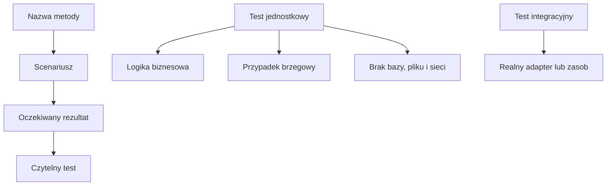

# 4. Dobre praktyki i typowe pułapki

## Nazwa testu jest dokumentacją

Nazwa testu powinna odpowiadać schematowi:

```text
NazwaMetody_Scenariusz_OczekiwanyRezultat
```

Przykład:

```csharp
[Fact]
public void Divide_DivisorIsZero_ThrowsArgumentException()
{
    Kalkulator kalkulator = new();

    Assert.Throws<ArgumentException>(() => kalkulator.Divide(10, 0));
}
```

Taka nazwa mówi, czego dotyczy test, jakie dane są ważne i co powinno się wydarzyć. Unikaj nazw `Test1`, `Sprawdzenie` i `Dziala`, bo nie pomagają odczytać raportu z CI.



Źródło: [diagram-granice-testu.mmd](diagram-granice-testu.mmd).

## Co warto testować?

Na początku skup się na logice, którą można wyrazić jako wejście i wynik:

- obliczenia i reguły biznesowe,
- walidację danych,
- wybór gałęzi `if` i `switch`,
- zmiany stanu publicznego obiektu,
- puste kolekcje i brakujące elementy,
- zera, wartości ujemne i granice zakresu,
- wyjątki określone w kontrakcie.

Dla metody przyjmującej zakres `0-100` dobierz przynajmniej `0`, `100`, wartość ze środka oraz `-1` i `101`, jeśli powinny być odrzucone.

## Czego unikać w teście jednostkowym?

### Prywatne szczegóły implementacji

Nie testuj prywatnej metody tylko dlatego, że istnieje. Testuj publiczny kontrakt, który jest wartością dla użytkownika klasy. Jeżeli prywatna metoda jest trudna do sprawdzenia, może to oznaczać zbyt dużą klasę albo brak wyraźnej odpowiedzialności.

### Baza danych, plik i sieć

Test, który otwiera prawdziwy plik albo łączy się z bazą, przestaje być szybkim i niezależnym testem jednostkowym. Taki scenariusz może być potrzebny, ale należy go nazwać testem integracyjnym i kontrolować jego środowisko.

```csharp
// Szybki test jednostkowy: zależność jest już danymi w pamięci.
Raport raport = new(new[] { new Sprzedaz("A", 10m) });
Assert.Equal(10m, raport.Suma());
```

```csharp
// To jest inny rodzaj testu i wymaga osobnego środowiska.
string tekst = File.ReadAllText("dane.txt");
```

### Czas, losowość i współdzielony stan

Unikaj `DateTime.Now`, `Random` bez kontrolowanego ziarna, `Thread.Sleep`, globalnych list i zależności od kolejności testów. Test powinien sam przygotować stan, którego potrzebuje, oraz sam zakończyć się po asercji.

Nie dodawaj sztucznego opóźnienia, aby „dać systemowi czas”. Jeżeli metoda jest asynchroniczna, testuj ją przez `await` i kontrolowaną zależność.

## Izolacja i jeden powód porażki

Test może mieć kilka instrukcji Arrange, ale powinien sprawdzać jedną regułę. Jeżeli jedna metoda testowa sprawdza jednocześnie cenę, logowanie, plik i wysyłkę HTTP, pojedyncza porażka nie powie, który kontrakt został złamany.

Dobrze:

```csharp
[Fact]
public void Dodaj_ValidProduct_IncreasesTotal()
{
    Koszyk koszyk = new();
    koszyk.Dodaj(new Produkt("notes", 12m));

    Assert.Equal(12m, koszyk.Suma());
}
```

Gorzej: test z dziesięcioma wywołaniami i dziesięcioma niezależnymi oczekiwaniami, którego nazwa mówi tylko `Koszyk_Dziala`.

## Projekt demonstracyjny

Projekt [Kod/SklepLogiczny.Tests/KoszykTests.cs](Kod/SklepLogiczny.Tests/KoszykTests.cs) sprawdza logikę koszyka bez pliku, bazy i konsoli. Każdy test tworzy własny koszyk, więc może być uruchomiony przed lub po dowolnym innym teście.

```powershell
dotnet test src/09-testy/04-dobre-praktyki-i-pulapki/Kod/SklepLogiczny.Tests/SklepLogiczny.Tests.csproj
```

## Zadania

1. Dodaj test pustego koszyka i nazwij go `Suma_EmptyCart_ReturnsZero`.
2. Dodaj test, że cena ujemna jest odrzucana.
3. Dodaj test najtańszego produktu dla koszyka z trzema produktami.
4. Napisz przykład testu, który byłby integracyjny, bo korzysta z pliku, i wyjaśnij, dlaczego nie należy mieszać go z testami jednostkowymi.
5. Zmień nazwę `Koszyk_Dziala` na nazwę opisującą metodę, scenariusz i wynik.

### Rozwiązania i wyjaśnienia

Pusty koszyk powinien mieć jawny kontrakt, najczęściej sumę `0` i brak najtańszego produktu reprezentowany przez `null`. Cena ujemna jest błędnym argumentem, dlatego test powinien oczekiwać `ArgumentOutOfRangeException`. Test pliku można umieścić w osobnym projekcie integracyjnym albo oznaczyć kategorią, aby nie spowalniał szybkiego zestawu jednostkowego.

## Instrukcja kompilacji i debugowania

```powershell
dotnet build
dotnet test
```

W Test Explorer uruchom pojedynczy test, a następnie całą klasę. Ustaw breakpoint w `Dodaj`, `Suma` i `NajtanszyProdukt`. Sprawdź, że kolejność uruchamiania testów nie wpływa na wynik.

## Źródła

- [Unit testing in .NET](https://learn.microsoft.com/dotnet/core/testing/),
- [Practical Test Pyramid - Martin Fowler](https://martinfowler.com/articles/practical-test-pyramid.html),
- [Test smells](https://testsmells.org/),
- [xUnit shared context](https://xunit.net/docs/shared-context).
