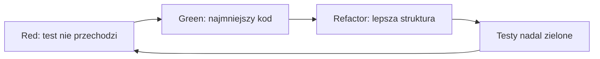
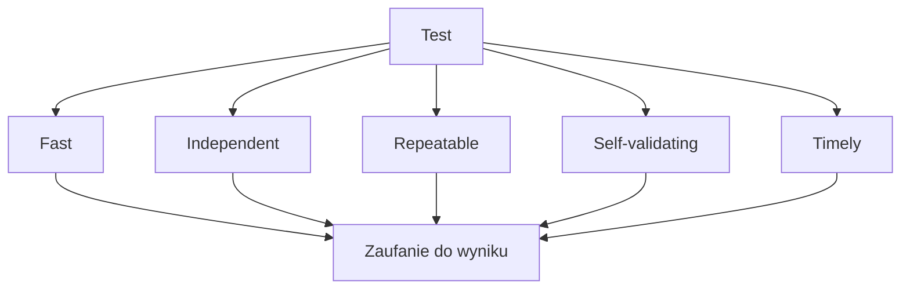

# 5. Test Driven Development i zasady FIRST

## TDD: najpierw zachowanie, potem implementacja

Test Driven Development (TDD) to technika projektowania kodu przez małe, powtarzalne cykle. Najpierw opisujemy obserwowalne zachowanie testem, potem dopisujemy minimalny kod i dopiero na końcu poprawiamy strukturę. Test nie jest celem samym w sobie: jest wykonywalnym przykładem kontraktu oraz szybkim klientem projektowanej metody.

TDD nie oznacza:

- napisania wszystkich testów po zakończeniu projektu,
- sprawdzania prywatnych zmiennych i kolejności instrukcji,
- dopisywania sztucznych testów tylko po to, aby podnieść procent pokrycia,
- akceptowania każdej implementacji, która przechodzi test bez sprawdzenia sensu oczekiwania.

W praktyce jeden cykl powinien być mały: jeden przypadek, jedna reguła, krótka informacja zwrotna. Dzięki temu student może zobaczyć, jak wymaganie wpływa na publiczny kontrakt oraz na kształt klasy.



Źródło: [diagram-red-green-refactor.mmd](diagram-red-green-refactor.mmd).

## Dlaczego warto stosować TDD?

TDD jest szczególnie przydatne, gdy reguła biznesowa ma jasne wejścia i wyniki. Zmusza do nazwania zachowania przed napisaniem szczegółów implementacji. To często ujawnia niejasne wymagania: czy `200 zł` daje darmową dostawę, czy dopiero kwota większa niż `200 zł`? Czy wartość ujemna ma być wyjątkiem, czy komunikatem walidacyjnym?

| Korzyść | Co widać w kodzie C# | Ograniczenie |
| --- | --- | --- |
| kontrakt przed implementacją | nazwa testu i asercja opisują publiczne zachowanie | test nie zastępuje rozmowy o wymaganiu |
| mały przyrost | zmiana dotyczy jednej reguły | duża funkcja wymaga wielu cykli |
| szybka regresja | `dotnet test` uruchamia wcześniejsze przypadki | test może być błędny albo zbyt wąski |
| lepszy projekt | zależności stają się widoczne w Arrange | nie każdą integrację da się sensownie testować jednostkowo |
| bezpieczny refactor | zielone testy chronią zachowanie | zielony zestaw nie dowodzi poprawności wszystkiego |

TDD nie jest dogmatem. Jeżeli wymaganie jest niejasne, najpierw wykonaj eksperyment lub doprecyzuj specyfikację. Jeżeli problem dotyczy wyglądu interfejsu, prototyp może być szybszy niż test jednostkowy. Gdy jednak reguła jest ważna i powtarzalna, test przed implementacją daje bardzo dobrą informację zwrotną.

## Przykład Red-Green-Refactor

Załóżmy, że koszt dostawy jest darmowy dla koszyka od `200 zł`, zwykły kosztuje `15 zł`, a ekspresowy `30 zł`.

### Red

Przyjmijmy kontrakt `KosztDostawy.Oblicz`: dostawa jest darmowa od `200 zł`, zwykła kosztuje `15 zł`, a ekspresowa `30 zł`. Najpierw zapisujemy przypadki, które chcemy przeprowadzić:

| Scenariusz | Dane | Oczekiwanie |
| --- | --- | --- |
| tani koszyk, zwykła dostawa | `0`, `false` | `15` |
| tani koszyk, ekspres | `0`, `true` | `30` |
| dokładny próg | `200`, dowolny tryb | `0` |
| droższy koszyk | `500`, dowolny tryb | `0` |
| wartość ujemna | `-1`, `false` | `ArgumentOutOfRangeException` |

Pierwszy test może nie kompilować się, jeżeli metoda jeszcze nie istnieje. W TDD błąd kompilacji jest również informacją z fazy Red: najpierw tworzymy minimalny publiczny kontrakt, a potem doprowadzamy test do stanu, w którym uruchamia się i przegrywa przez brak implementacji.

```csharp
[Fact]
public void Oblicz_DuzyKoszyk_ReturnsFreeDelivery()
{
    decimal wynik = KosztDostawy.Oblicz(200m, ekspres: false);

    Assert.Equal(0m, wynik);
}
```

Jeżeli metoda jeszcze nie istnieje albo zwraca wartość domyślną, test jest czerwony. To dobry sygnał: test pokazuje brak zachowania. Czerwony test powinien przegrywać z właściwego powodu, dlatego warto upewnić się, że nie kończy się błędem konfiguracji test runnera.

Uruchom tylko jeden przypadek:

```powershell
dotnet test src/09-testy/05-tdd-i-first/Kod/TddKalkulator.Tests/TddKalkulator.Tests.csproj --filter "FullyQualifiedName~Oblicz_DuzyKoszyk"
```

### Green

Piszemy najmniejszą implementację spełniającą pierwszy kontrakt. Nie dodajemy jeszcze abstrakcji, fabryki ani konfiguracji z pliku:

```csharp
public static decimal Oblicz(decimal wartoscKoszyka, bool ekspres)
{
    if (wartoscKoszyka >= 200m)
    {
        return 0m;
    }

    return ekspres ? 30m : 15m;
}
```

Teraz test przechodzi, ale nie wolno jeszcze uznać funkcji za ukończoną. Jeden test chroni tylko jeden przykład. Dopisujemy kolejne testy i pozwalamy, aby następny przypadek wymusił rozwój implementacji:

```csharp
[Theory]
[InlineData(0, false, 15)]
[InlineData(0, true, 30)]
[InlineData(199.99, false, 15)]
[InlineData(199.99, true, 30)]
public void Oblicz_TaniKoszyk_ReturnsCorrectCost(
    decimal wartoscKoszyka,
    bool ekspres,
    decimal oczekiwany)
{
    decimal wynik = KosztDostawy.Oblicz(wartoscKoszyka, ekspres);

    Assert.Equal(oczekiwany, wynik);
}
```

Test parametryzowany nie jest skrótem dla przypadków o różnych regułach. Tutaj wszystkie wiersze sprawdzają tę samą regułę: koszyk poniżej progu płaci za wybrany typ dostawy.

### Refactor

Po dodaniu testów walidujących wartości ujemne i oba rodzaje dostawy można nazwać stałe, wydzielić walidację i uporządkować testy. Przykład bezpiecznej refaktoryzacji:

```csharp
public static class KosztDostawy
{
    public const decimal DarmowaDostawaOd = 200m;
    public const decimal KosztZwykly = 15m;
    public const decimal KosztEkspresowy = 30m;

    public static decimal Oblicz(decimal wartoscKoszyka, bool ekspres)
    {
        if (wartoscKoszyka < 0)
        {
            throw new ArgumentOutOfRangeException(nameof(wartoscKoszyka));
        }

        if (wartoscKoszyka >= DarmowaDostawaOd)
        {
            return 0m;
        }

        return ekspres ? KosztEkspresowy : KosztZwykly;
    }
}
```

Po refaktoryzacji wszystkie testy muszą nadal przechodzić. Jeżeli zmieniamy zachowanie, nie jest to już refaktoryzacja, tylko kolejny krok projektowy, który powinien mieć nowy lub zmieniony test.

## TDD jako pętla projektowa

Pełny cykl nie kończy się na jednym teście:

1. wypisz przypadki z wymagania,
2. wybierz najmniejszy przypadek, który opisuje nową regułę,
3. napisz test i upewnij się, że porażka jest sensowna,
4. dopisz minimalny kod,
5. uruchom cały zestaw regresji,
6. popraw nazwy, duplikację i strukturę,
7. dopiero wtedy wybierz następny przypadek.

Przydatne pytanie po każdym cyklu brzmi: „Jaki błąd wykryłby ten test, gdybym teraz pomylił znak `>=` z `>` albo zwrócił koszt ekspresowy dla dostawy zwykłej?”. Jeżeli odpowiedź brzmi „żaden”, przypadek jest zbyt słaby albo oczekiwanie nie opisuje ważnej reguły.

## TDD przy pracy z AI

AI może przyspieszyć tworzenie szkicu testów, ale nie jest właścicielem specyfikacji. Przydatny przepływ pracy:

1. samodzielnie zapisz kontrakt i przypadki brzegowe,
2. poproś AI o propozycje dodatkowych danych, ale nie o ślepe „naprawienie testu”,
3. przeczytaj każdy test i sprawdź, czy `Expected` wynika z wymagania,
4. uruchom test przed zmianą implementacji,
5. zmieniaj mały fragment i obserwuj Red-Green-Refactor,
6. sprawdź, czy AI nie zmieniło jednocześnie kodu i oczekiwania w sposób ukrywający błąd.

Typowe ryzyko generowania testów przez AI to testowanie implementacji zamiast zachowania, powtarzanie tych samych przypadków oraz orakle wyliczone tym samym błędnym wzorem co kod produkcyjny. Człowiek powinien dostarczyć kontrakt, przykłady i decyzje domenowe.

### Bezpieczny sposób pracy z AI

AI warto traktować jako generator hipotez i przypadków, a nie jako autora specyfikacji. Przykładowy prompt roboczy może brzmieć:

```text
Mam metodę C# KosztDostawy.Oblicz(decimal wartoscKoszyka, bool ekspres).
Kontrakt: od 200 zł dostawa kosztuje 0 zł, poniżej progu zwykła kosztuje 15 zł,
a ekspresowa 30 zł; wartość ujemna jest błędna.
Zaproponuj macierz przypadków, ale nie pisz implementacji.
Wyjaśnij, którą regułę sprawdza każdy przypadek.
```

Następnie student powinien:

- odrzucić przypadki, które nie wynikają z kontraktu,
- sprawdzić ręcznie wartości oczekiwane,
- napisać pierwszy test samodzielnie albo przejrzeć każdą linię wygenerowanego testu,
- uruchomić Red przed zaakceptowaniem implementacji,
- użyć AI do przeglądu brakujących przypadków, a nie do jednoczesnej zmiany kodu i asercji,
- po poprawce uruchomić pełny zestaw regresji.

Przykład ryzykownej prośby: „Napraw kod i testy, aż wszystko będzie zielone”. Taka prośba może zmienić `Expected` z `0` na błędne `15`, zamiast znaleźć błąd w implementacji. Lepsza prośba brzmi: „Zinterpretuj porażkę, wskaż możliwe przyczyny, ale nie zmieniaj oczekiwania bez uzasadnienia kontraktem”.

## FIRST

Skrót FIRST jest praktycznym filtrem jakości testu. Nie chodzi o mechaniczne odhaczenie pięciu słów, lecz o utrzymanie zaufania do czerwonego i zielonego wyniku. Jeżeli testy są wolne, zależne, losowe albo wymagają ręcznej interpretacji, programista zaczyna je omijać, a wtedy tracą wartość jako zabezpieczenie zmiany.



Źródło: [diagram-first.mmd](diagram-first.mmd).

### F - Fast: szybki

Test jednostkowy powinien wykonywać się na tyle szybko, aby można było uruchamiać go po małej zmianie. Tysiące prostych testów powinny dawać informację w sekundach lub minutach, a nie wymagać ręcznego planowania.

```csharp
// Wolno i krucho: test czeka na czas zamiast kontrolować zależność.
Thread.Sleep(1000);
Assert.True(czyGotowe);
```

```csharp
// Szybko: przekazujemy dane i sprawdzamy wynik bez oczekiwania.
bool wynik = Walidator.CzyPoprawnaOcena(100);
Assert.True(wynik);
```

Szybkość nie oznacza, że każdy test integracyjny jest zły. Oznacza, że wolne testy powinny być rozpoznawalne i uruchamiane na właściwym etapie, a szybkie testy jednostkowe nie powinny otwierać bazy, pliku ani sieci.

### I - Independent: niezależny

Każdy test powinien przygotować własny stan. Nie zakładaj, że poprzedni test dodał produkt do statycznej listy albo ustawił globalną konfigurację.

```csharp
private static readonly List<string> nazwy = [];

[Fact]
public void Dodaj_Name_IsVisible()
{
    nazwy.Add("A");
    Assert.Contains("A", nazwy);
}
```

Ten test może przejść lokalnie, ale kolejny test może zobaczyć nieoczekiwane `"A"`. Lepszy jest obiekt tworzony wewnątrz testu:

```csharp
[Fact]
public void Dodaj_Name_IsVisible()
{
    List<string> nazwy = [];
    nazwy.Add("A");

    Assert.Contains("A", nazwy);
}
```

Niezależność ułatwia powtórzenie jednego testu, uruchamianie testów w innej kolejności i równoległe wykonywanie zestawu.

### R - Repeatable: powtarzalny

Powtarzalny test daje ten sam wynik niezależnie od pory uruchomienia, komputera i kolejności. Źródłami niestabilności są między innymi `DateTime.Now`, bieżąca kultura, losowość, strefa czasowa, port sieciowy i pliki pozostawione przez poprzedni test.

```csharp
// Wynik zmienia się wraz z zegarem systemowym.
bool jestDzienRoboczy = DateTime.Now.DayOfWeek is not DayOfWeek.Saturday
    and not DayOfWeek.Sunday;
```

W kodzie produkcyjnym lepiej wstrzyknąć zegar albo przekazać datę jako argument. W prostym ćwiczeniu można testować metodę czystą:

```csharp
static bool JestDzienRoboczy(DateTime data)
{
    return data.DayOfWeek is not DayOfWeek.Saturday
        and not DayOfWeek.Sunday;
}

[Fact]
public void JestDzienRoboczy_Saturday_ReturnsFalse()
{
    Assert.False(JestDzienRoboczy(new DateTime(2026, 9, 26)));
}
```

### S - Self-validating: samosprawdzający się

Test powinien sam zgłosić sukces albo porażkę przez asercję. Samo wypisanie wyniku do konsoli nie jest testem automatycznym, bo człowiek musi go obejrzeć i pamiętać oczekiwanie.

```csharp
// To demonstracja, ale nie samosprawdzający się test.
Console.WriteLine(kalkulator.Add(2, 3));
```

```csharp
// Wynik ma jednoznaczny status dla IDE i CI.
Assert.Equal(5, kalkulator.Add(2, 3));
```

Samosprawdzalność wymaga także, aby test nie połykał wyjątków, nie kończył się zawsze `return` i nie używał ręcznego komunikatu typu „sprawdź wzrokowo”.

### T - Timely: napisany na czas

Test powinien powstać wystarczająco wcześnie, aby wpłynąć na projekt i złapać błąd zanim kod zostanie użyty w wielu miejscach. W TDD oznacza to test przed implementacją. W zwykłym procesie może to być test napisany razem z metodą lub natychmiast po naprawie błędu.

Przykład regresji:

1. użytkownik zgłasza, że `CenaPoRabacie(100, 100)` zwraca `100`,
2. najpierw dodajemy test oczekujący `0`,
3. upewniamy się, że test przegrywa na starej wersji,
4. poprawiamy kod,
5. test zostaje na stałe jako ochrona przed powrotem błędu.

Test napisany dopiero po wielu miesiącach może nadal być wartościowy, ale nie pomoże już w zaprojektowaniu pierwotnego API. Timely nie oznacza „zawsze przed kodem”; oznacza „zanim koszt zmiany i diagnozy stanie się niepotrzebnie duży”.

## Jak FIRST współpracuje z TDD?

Red-Green-Refactor mówi **kiedy** wykonać mały krok, a FIRST mówi **jaki powinien być test**, aby ten krok dawał wiarygodną informację. Przykładowo:

- Red bez Fast prowadzi do unikania testów,
- Green bez Self-validating daje tylko pozorne poczucie sukcesu,
- Refactor bez Independent może ujawnić przypadkową zależność od kolejności,
- Timely pomaga odkryć nieporęczne API zanim zostanie utrwalone,
- Repeatable sprawia, że wynik cyklu można odtworzyć na CI.

## Projekt demonstracyjny i zadania

Projekt [Kod/TddKalkulator.Tests/KosztDostawyTests.cs](Kod/TddKalkulator.Tests/KosztDostawyTests.cs) zawiera końcowy, zielony rezultat cyklu. Historia Red jest opisana w README, ponieważ repozytorium edukacyjne powinno kończyć się kodem, który można zbudować bez oczekiwanych porażek.

```powershell
dotnet test src/09-testy/05-tdd-i-first/Kod/TddKalkulator.Tests/TddKalkulator.Tests.csproj
```

1. Dodaj test dla zwykłej dostawy poniżej `200 zł`, a następnie test dla dostawy ekspresowej.
2. Dodaj walidację ujemnej wartości koszyka i przeprowadź Red-Green-Refactor.
3. Wydziel stałe `DarmowaDostawaOd`, `KosztZwykly` i `KosztEkspresowy`.
4. Znajdź w jednym ze swoich testów zależność od czasu, losowości albo kolejności i zaproponuj jej usunięcie.
5. Poproś narzędzie AI o trzy przypadki brzegowe, ale zaakceptuj tylko te, które potrafisz uzasadnić kontraktem.
6. Do każdego z pięciu testów z laboratorium dopisz krótką ocenę FIRST: dowód, że zasada jest spełniona, albo konkretny refactor.
7. Napisz test, który przegrywa z powodu `DateTime.Now`, a następnie zmień metodę tak, aby przyjmowała `DateTime` jako argument.

### Rozwiązania i wyjaśnienia

Końcowy zestaw powinien obejmować co najmniej: koszyk pusty lub tani, dokładnie `200 zł`, koszyk droższy, tryb zwykły, tryb ekspresowy oraz wartość ujemną. Stałe poprawiają czytelność i ograniczają powtórzenie liczb. Testy powinny pozostać niezależne i nie korzystać z zegara ani plików.

W zadaniu z `DateTime.Now` test jest niestabilny, bo po północy może zmienić wynik bez zmiany kodu. Przekazanie `DateTime data` do metody przenosi decyzję o czasie do testu i pozwala podać stały przypadek, na przykład sobotę. To jednocześnie poprawia Repeatable i Independent.

## Literatura i nagrania

- [Clean Code - Robert C. Martin](https://www.oreilly.com/library/view/clean-code-a/9780136083238/),
- [Clean Coders - Robert C. Martin](https://cleancoders.com/),
- [Test-Driven Development - Martin Fowler](https://martinfowler.com/bliki/TestDrivenDevelopment.html),
- [Unit testing in .NET](https://learn.microsoft.com/dotnet/core/testing/).
