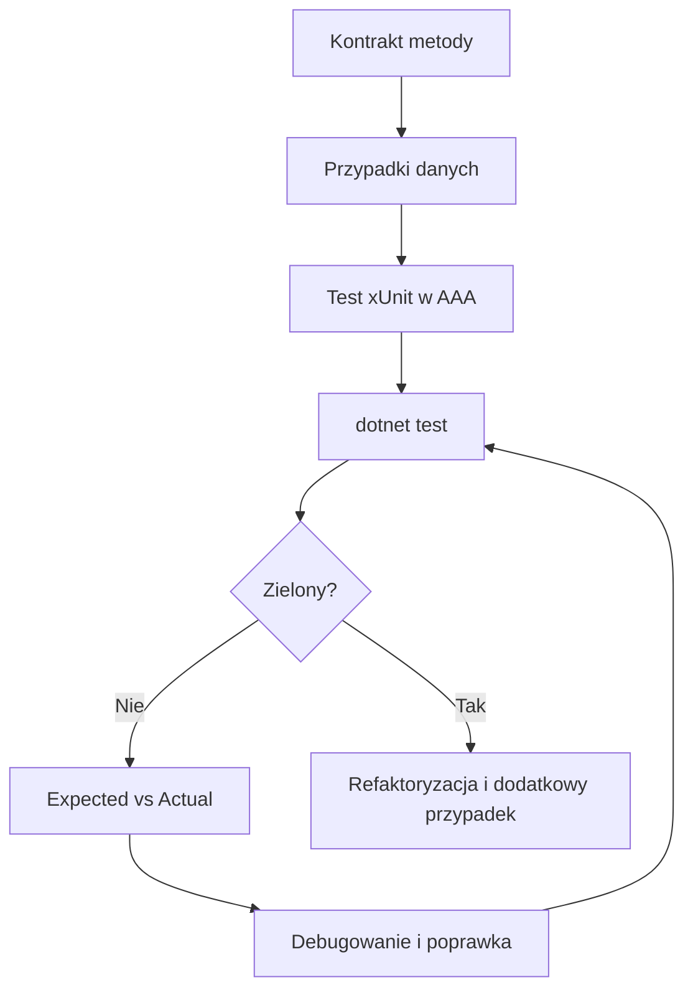

# 6. Laboratorium i zadania z rozwiązaniami

## Cel laboratorium

Student ma przejść cały cykl pracy z testem: zapisać kontrakt, wybrać dane typowe i brzegowe, napisać test w xUnit, uruchomić go, zinterpretować wynik, poprawić implementację i ocenić jakość testu.

## Przebieg

1. Zbuduj projekt produkcyjny i testowy.
2. Przeczytaj kontrakty metod przed napisaniem asercji.
3. Dla każdego zadania zapisz przypadek typowy, graniczny i niepoprawny.
4. Napisz testy w AAA.
5. Uruchom `dotnet test` i sprawdź raport.
6. Ustaw breakpoint w metodzie produkcyjnej oraz w teście.
7. Celowo zepsuj jedną regułę, odczytaj `Expected` i `Actual`, a następnie przywróć poprawny kod.



Źródło: [diagram-laboratorium-testy.mmd](diagram-laboratorium-testy.mmd).

## Zadania do samodzielnego wykonania

### Zadanie 1: sprawdzenie oceny

Napisz teorię dla `CzyPoprawnaOcena(int punkty)`. Ocena jest poprawna, gdy mieści się w zakresie `0-100`. Sprawdź `0`, `50`, `100`, `-1` i `101`.

### Zadanie 2: średnia ocen

Napisz testy dla `Srednia(IReadOnlyList<int> oceny)`. Sprawdź jedną ocenę, kilka ocen, wynik ułamkowy oraz pustą listę. Pusta lista ma zgłaszać `ArgumentException`.

### Zadanie 3: najczęstsze słowo

Napisz testy dla `NajczestszeSlowo(string? tekst)`. Sprawdź tekst z powtórzeniami, różną wielkość liter, puste dane i `null`. Dla braku słów metoda zwraca `null`.

### Zadanie 4: cena po rabacie

Napisz `[Theory]` dla ceny `100`, rabatu `0`, `20` i `100`. Dodaj osobne testy wyjątków dla ceny ujemnej i rabatu spoza zakresu `0-100`.

### Zadanie 5: jakość testu

Wybierz jeden test i opisz, jak spełnia FIRST. Następnie dopisz przykład testu, który łamałby jedną z zasad, na przykład korzystałby z `DateTime.Now` albo współdzielonej listy statycznej.

### Zadanie 6: naprawa czerwonego testu

Zmień implementację jednej metody tak, aby jeden test stał się czerwony. Zapisz `Expected`, `Actual`, pierwszą błędną wartość w debuggerze i poprawkę.

## Rozwiązania

Kod rozwiązań znajduje się w [Kod/ZadaniaTestowe.Tests/RozwiazaniaTests.cs](Kod/ZadaniaTestowe.Tests/RozwiazaniaTests.cs). Każdy test jest wykonywalnym rozwiązaniem, a kod produkcyjny w [Kod/ZadaniaTestowe/Zadania.cs](Kod/ZadaniaTestowe/Zadania.cs) zawiera kontrakty metod.

```csharp
[Theory]
[InlineData(0, true)]
[InlineData(100, true)]
[InlineData(-1, false)]
[InlineData(101, false)]
public void CzyPoprawnaOcena_ReturnsExpectedResult(
    int punkty,
    bool oczekiwany)
{
    bool wynik = Walidator.CzyPoprawnaOcena(punkty);

    Assert.Equal(oczekiwany, wynik);
}
```

```csharp
[Fact]
public void Srednia_EmptyCollection_ThrowsArgumentException()
{
    Assert.Throws<ArgumentException>(() => Statystyka.Srednia([]));
}
```

```csharp
[Fact]
public void NajczestszeSlowo_EmptyText_ReturnsNull()
{
    string? wynik = AnalizatorTekstu.NajczestszeSlowo("   ");

    Assert.Null(wynik);
}
```

Rozwiązania są celowo krótkie. Ważniejsza od liczby linii jest zgodność oczekiwania z kontraktem oraz objęcie przypadków, które mogłyby zmienić gałąź warunku.

## Instrukcja kompilacji, uruchamiania i debugowania

```powershell
dotnet build src/09-testy/06-laboratorium-i-zadania/Kod/ZadaniaTestowe.Tests/ZadaniaTestowe.Tests.csproj
dotnet test src/09-testy/06-laboratorium-i-zadania/Kod/ZadaniaTestowe.Tests/ZadaniaTestowe.Tests.csproj
```

W VS Code otwórz panel **Testing**, wybierz `RozwiazaniaTests` albo pojedynczy test i uruchom debugowanie. W Visual Studio użyj **Test Explorer**, a w Riderze **Unit Tests**. Breakpointy ustaw w `CzyPoprawnaOcena`, `Srednia`, `NajczestszeSlowo` i `CenaPoRabacie`.

## Kryteria oceny

- testy mają opisowe nazwy,
- każdy test ma czytelny podział Arrange - Act - Assert,
- przypadki brzegowe wynikają z kontraktu,
- testy nie zależą od siebie i nie używają plików ani sieci,
- wyjątki są sprawdzane przez `Assert.Throws<TException>`,
- teoria nie powiela testów, gdy reguła jest ta sama dla wielu danych,
- student potrafi odczytać i wyjaśnić komunikat `Expected` versus `Actual`.

## Źródła

- [Unit testing C# code with xUnit](https://learn.microsoft.com/dotnet/core/testing/unit-testing-csharp-with-xunit),
- [xUnit.net documentation](https://xunit.net/docs/getting-started/v2/getting-started),
- [Clean Code - Robert C. Martin](https://www.oreilly.com/library/view/clean-code-a/9780136083238/),
- [Clean Coders - Robert C. Martin](https://cleancoders.com/).
