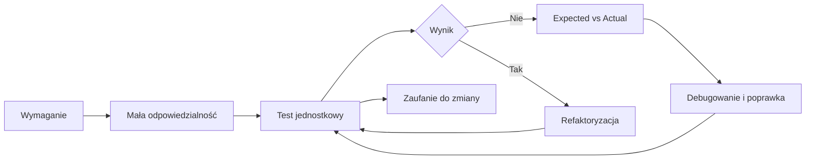

# 09. Testy jednostkowe i TDD w języku C sharp

Moduł pokazuje, po co automatyzować sprawdzanie programu, jak oddzielić kod aplikacji od projektu testowego oraz jak pisać pierwsze testy jednostkowe w xUnit. Student przechodzi od motywacji i ręcznego sprawdzania do asercji, testów parametryzowanych, dobrych praktyk i cyklu Test Driven Development.

Wszystkie przykłady są napisane w C# i przygotowane dla .NET 9 lub nowszego. Projekty testowe korzystają z xUnit 2.9.3, ale opisane zasady można przenieść do NUnit albo MSTest.

## Mapa tematów

1. [Po co w ogóle testujemy?](01-po-co-testujemy/README.md) - koszt błędu, ograniczenia testów manualnych, definicja testu jednostkowego i zasady dobrego testu.
2. [Pierwszy test w C# i xUnit](02-pierwszy-test-xunit/README.md) - rozdzielenie `MyApp` i `MyApp.Tests`, AAA, `[Fact]`, `[Theory]` i `[InlineData]`.
3. [Asercje i interpretacja wyników](03-assert-i-wyniki/README.md) - `Assert.Equal`, `Assert.True`, `Assert.Null`, wyjątki oraz czytanie `Expected` i `Actual`.
4. [Dobre praktyki i pułapki](04-dobre-praktyki-i-pulapki/README.md) - nazewnictwo, przypadki brzegowe, niezależność i granica między testem jednostkowym a integracyjnym.
5. [TDD i zasady FIRST](05-tdd-i-first/README.md) - Red-Green-Refactor, testowanie podczas pracy z AI oraz pięć właściwości dobrych testów.
6. [Laboratorium i zadania z rozwiązaniami](06-laboratorium-i-zadania/README.md) - ćwiczenia do samodzielnego wykonania, kompletne rozwiązania i kryteria oceny.



Źródło: [diagram-mapa-testy.mmd](diagram-mapa-testy.mmd).

## Cele modułu

Po zakończeniu modułu student potrafi:

- wyjaśnić, dlaczego ręczne przeklikanie programu nie zastępuje testów automatycznych,
- zdefiniować test jednostkowy jako weryfikację małego, odizolowanego fragmentu kodu,
- rozdzielić projekt aplikacji od projektu testowego i dodać referencję projektu,
- zapisać test w strukturze Arrange - Act - Assert,
- użyć `[Fact]`, `[Theory]` oraz `[InlineData]`,
- dobrać `Assert.Equal`, `Assert.True`, `Assert.Null` i `Assert.Throws<TException>`,
- odczytać różnicę między oczekiwaniem a wynikiem rzeczywistym,
- zaprojektować testy dla wartości pustych, zerowych, ujemnych i granicznych,
- rozpoznać test zależny od czasu, kolejności, pliku, bazy albo sieci,
- opisać cykl Red-Green-Refactor i ocenić testy wygenerowane przez AI,
- stosować zasady FIRST: Fast, Independent, Repeatable, Self-validating, Timely.

## Proponowany wykład

1. Zacznij od krótkiego programu, który działa dla jednego przykładu, ale błędnie obsługuje zero albo pustą wartość.
2. Porównaj przeklikanie programu z automatycznym uruchomieniem dziesiątek przypadków po każdej zmianie.
3. Zdefiniuj małą jednostkę kodu i narysuj granicę między `MyApp` oraz `MyApp.Tests`.
4. Napisz pierwszy test w AAA, a potem zamień powtarzający się kod na `[Theory]` i `[InlineData]`.
5. Celowo zepsuj implementację i pokaż komunikat `Expected` versus `Actual` w VS Code, Visual Studio albo Riderze.
6. Omów testy brzegowe oraz sytuacje, których nie należy udawać testami jednostkowymi, na przykład realną bazę danych.
7. Przeprowadź Red-Green-Refactor na małej metodzie i pokaż, gdzie AI pomaga generować przypadki, a gdzie może utrwalić błąd.
8. Zakończ laboratorium, w którym student dopisuje testy do istniejącego kontraktu.

## Wspólna instrukcja uruchamiania

W katalogu konkretnego projektu:

```powershell
dotnet build
dotnet test
```

Dla aplikacji konsolowej użyj `dotnet run`. Z katalogu repozytorium można uruchomić na przykład:

```powershell
dotnet test src/09-testy/02-pierwszy-test-xunit/Kod/MyApp.Tests/MyApp.Tests.csproj
```

W Visual Studio Code otwórz panel **Testing**, uruchom pojedynczy test albo całą grupę i ustaw breakpoint w kodzie produkcyjnym lub testowym. W Visual Studio użyj okna **Test Explorer**. W Riderze testy są widoczne w **Unit Tests**. `F10` przechodzi przez instrukcje, `F11` wchodzi do testowanej metody, a **Call Stack** pokazuje drogę od testu do kodu aplikacji.

## Jak czytać wynik testów

- zielony test oznacza, że kod spełnił konkretne oczekiwanie, nie że cały program jest poprawny,
- czerwony test wymaga przeczytania nazwy testu, stosu wywołań oraz komunikatu asercji,
- `Expected` to wartość zapisana w teście jako kontrakt,
- `Actual` to wartość zwrócona przez bieżącą implementację,
- błąd kompilacji testu oznacza zwykle problem z typem, przestrzenią nazw, referencją projektu albo składnią atrybutu,
- test zakończony wyjątkiem innym niż oczekiwany wymaga sprawdzenia danych wejściowych i kontraktu metody.

## Literatura i źródła

- [Unit testing in .NET](https://learn.microsoft.com/dotnet/core/testing/),
- [Write unit tests with .NET Core and xUnit](https://learn.microsoft.com/dotnet/core/testing/unit-testing-csharp-with-xunit),
- [xUnit.net documentation](https://xunit.net/docs/getting-started/v2/getting-started),
- [NUnit documentation](https://docs.nunit.org/),
- [MSTest documentation](https://learn.microsoft.com/dotnet/core/testing/unit-testing-mstest-writing-tests),
- [Code coverage in .NET](https://learn.microsoft.com/dotnet/core/testing/unit-testing-code-coverage),
- [Clean Code, Robert C. Martin](https://www.oreilly.com/library/view/clean-code-a/9780136083238/),
- [Clean Coders](https://cleancoders.com/), materiały i nagrania Roberta C. Martina.

Linki źródłowe zostały sprawdzone przed publikacją modułu.
